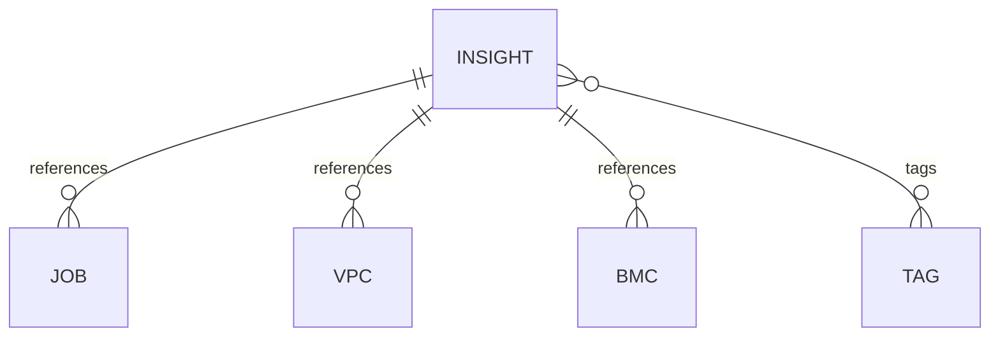

# DB間 Relation 図

## Mermaid（プレースホルダ）

実際のDB名・リレーション名に合わせて編集してください。

```mermaid
erDiagram
  INSIGHT ||--o{ JOB : "references"
  INSIGHT ||--o{ VPC : "references"
  INSIGHT ||--o{ BMC : "references"
  INSIGHT }o--o{ TAG : "tags"
```

## 正規定義

- `schemas/relations.md`
